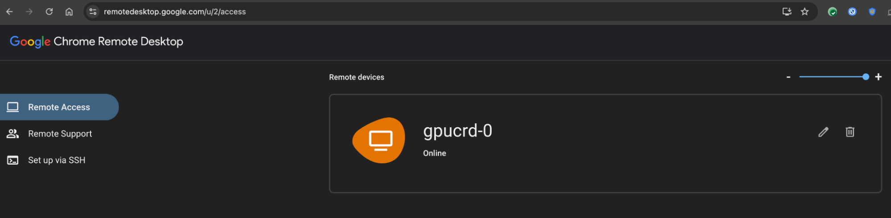
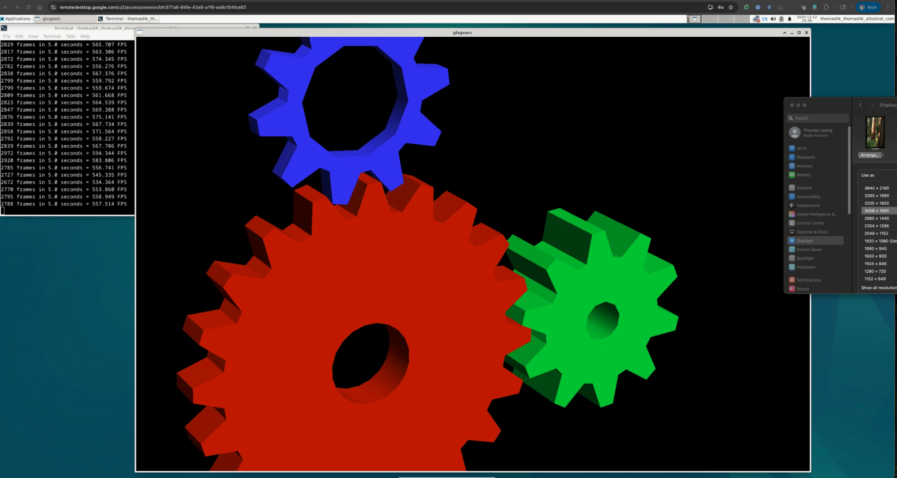

# Chrome Remote Desktop with G4 GPU using Cluster Toolkit deployment 

This document outlines the deployment of a GPU-enabled Chrome Remote Desktop session using the Cluster toolkit. This setup utilizes the cutting-edge NVIDIA RTX Pro 6000 GPU (g4-standard-48) and is relevant for high-performance computing (HPC) and graphics-intensive workloads requiring remote visualization.


## Advantages of this Solution

1. Cloud Identity is seamlessly integrated for authentication.
2. GPU resources are fully utilized - VirtualGL is included
3. The Cluster toolkit provides flexibility for customizing the VM shape and integrating with storage/disk usage.

Cluster toolkit link: [https://github.com/GoogleCloudPlatform/cluster-toolkit/tree/main/modules](https://github.com/GoogleCloudPlatform/cluster-toolkit/tree/main/modules)

Prerequisite: Follow the setup instructions for the Cluster toolkit.

There are 3 different Cluster Toolkit yaml files in this repo. 

- g4-crd.yaml - This is the latest addition to Google Cloud Platform with NVIDIA RTX Pro 6000 GPU.
- ubuntu22-g2-crd.yaml - This leverages NVIDIA L4 GPU with Ubuntu 22 image.
- t4-crd.yaml - This leverages NVIDIA T4 GPU with n1-standard instance. 

## Installation:
The following example are based on g4-crd.yaml blueprint. 

Step 1 - Run the command to create the deployment folder:

```
./ghpc create g4-crd.yaml
```

Step 2 - Execute the deployment:
```
./ghpc deploy g4-crd
```
After the machine provisioned, Login to the system and wait for the confirmation message: NOTICE : The Cluster Toolkit startup scripts have finished running successfully. 
This can take about 10 mins. 

Step 3 - Navigate to the Chrome Remote Desktop page: https://remotedesktop.google.com/u/2/headless
Click on "Set up via SSH" and copy the Debian Linux command.


Step 4 - Run the copied command within the SSH session:
```
thomashk_thomashk_altostrat_com@gpucrd-0:/tmp$ DISPLAY= /opt/google/chrome-remote-desktop/start-host --code="4/0ATX87lNnihkxL1TYveDiVXe5cJVjubb_lsUBdnfQ4v94zLqqic90Zxxxxxx_GPUQ6CziQ" --redirect-url="https://remotedesktop.google.com/_/oauthredirect" --name=$(hostname)
```
Set up a PIN when prompted:
Enter a PIN of at least six digits:
Enter the same PIN again:

Wait for the message: "Host started successfully."

Step 5 - Return to the Remote Access tab and log into the newly visible machine:


## Check on the performance and tools available:

- using NVIDIA-smi command:
  By using "nvidia-smi" command to make sure the driver is installed correctly:
```
thomashk_thomashk_altostrat_com@gpucrd-0:/tmp$ nvidia-smi
Fri Dec 12 16:40:20 2025       
+-----------------------------------------------------------------------------------------+
| NVIDIA-SMI 580.95.05              Driver Version: 580.95.05      CUDA Version: 13.0     |
+-----------------------------------------+------------------------+----------------------+
| GPU  Name                 Persistence-M | Bus-Id          Disp.A | Volatile Uncorr. ECC |
| Fan  Temp   Perf          Pwr:Usage/Cap |           Memory-Usage | GPU-Util  Compute M. |
|                                         |                        |               MIG M. |
|=========================================+========================+======================|
|   0  NVIDIA RTX PRO 6000 Blac...    On  |   00000000:05:00.0 Off |                    0 |
| N/A   27C    P0             45W /  600W |      60MiB /  97887MiB |      0%      Default |
|                                         |                        |             Disabled |
+-----------------------------------------+------------------------+----------------------+

+-----------------------------------------------------------------------------------------+
| Processes:                                                                              |
|  GPU   GI   CI              PID   Type   Process name                        GPU Memory |
|        ID   ID                                                               Usage      |
|=========================================================================================|
|    0   N/A  N/A           43050      G   /usr/lib/xorg/Xorg                       18MiB |
|    0   N/A  N/A           43093      G   /usr/bin/gnome-shell                     22MiB |
+-----------------------------------------------------------------------------------------+
```
  
- check if virtualGL is installed:
```
ls /opt/VirtualGL/bin/vglrun
ls /opt/VirtualGL/bin/glxinfo
```
If these two commands are not available. VirtualGL is not installed. 

- basic "glxgears" command:
Performance Validation:
Running "glxgears" at almost full screen (3008 x 1692 resolution) yielded approximately 570 FPS, confirming GPU usage:


